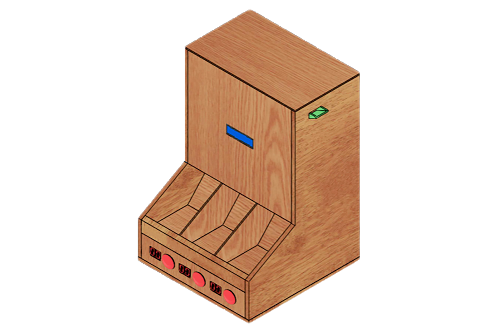

# Introducing Cointer, a coin counter (yes) 

This project is a realization of a coin sorter. It uses lasers and photoresistors : the coin cuts the beam and increments the 7 segments displays while pressing a button decrements these displays.

You will find here the main code of this project but also simulation and 2D plans.

* Library requirement : My [Simple I/O Library](https://github.com/JRodez/Simple-I-O-Library-Arduino-WPI) ([docs]())

* Component list for 3 columns :

  | Component                                  |  Count   |
  | :----------------------------------------- | :------: |
  | 7 segment display (common anode)           |    6     |
  | Button                                     |    3     |
  | BCD (4511)                                 |    3     |
  | Resistor  ~470 ohms                        | 21 (7*3) |
  | Arduino MEGA (or Arduino with enough pins) |    1     |
  | Photosensor                                |    3     |
  | Resistor  ~1kohm                           |    3     |
  | Laser                                      |    3     |
  
  

## Resources: 

* [Code explanation](cointer.ino.md) 
* [Plans for building](./plans.md)

