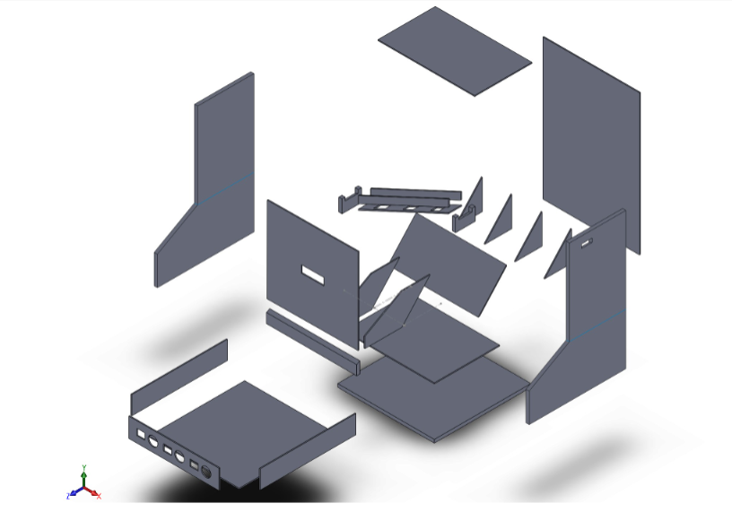

# Construction of the [case ](ressources/photo.pdf)and connection of the electronics

## 2D drawing :

* Here is [the parts you have to make in 3 millimeter thickness](ressources/3mm_parts.pdf) and [10 millimeter thickness](ressources/10mm_parts.pdf)
* The 3d printed pipes you have to place in each column : [1 euro](ressources/pipe_1_euro.stl) , [2 euro](ressources/pipe_2_euros.stl) , [50 cents](ressources/pipe_50_cents.stl) 

Exploded view : 

thanks to Anthony Chaigneau for this.

## Electronics scheme 

You can find the Proteus simulation [here](https://github.com/JRodez/Cointer/tree/main/proteus)

